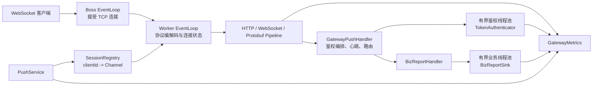

# Message Gateway

基于 Netty 与 Protobuf 的独立 WebSocket 推送网关实现。

项目使用 Lombok 简化 Java 样板代码：`@Slf4j` 生成日志字段，`@Getter` 生成配置访问器，
`@RequiredArgsConstructor` 生成依赖注入构造器，`@Value` 生成不可变指标快照。
源码中已补充中文注释，重点说明协议职责、线程模型、会话生命周期、背压和指标语义。

## 已实现能力

- 使用 `src/main/proto/push.proto` 定义统一顶级 `Frame`，覆盖 `TYPE_UNSPECIFIED`、`PING`、`PONG`、`CONNECT`、`CONNECT_ACK`、`NOTIFY`、`BIZ_REPORT`，避免 Protobuf 默认枚举值被误判为有效业务帧。
- 使用 `WebSocketProtobufDecoder` 将 `BinaryWebSocketFrame` 解码为 Protobuf `Frame`。
- 使用 `WebSocketProtobufEncoder` 将 Protobuf `Frame` 编码为 WebSocket 二进制帧。
- 使用 `GatewayPushHandler` 处理连接鉴权、本地会话映射、认证前拦截、不支持帧拒绝、业务心跳和连接清理。
- 使用 `BizReportHandler` 将 `BIZ_REPORT` 上报投递到有界业务线程池，队列饱和时明确拒绝，避免阻塞 Netty IO 线程或无限堆积。
- 使用独立有界鉴权线程池执行 `TokenAuthenticator`，避免远程鉴权或签名计算阻塞 Netty IO 线程。
- 在 Netty pipeline 中加入 `WebSocketFrameAggregator`，支持合法的 WebSocket 二进制分片消息。
- 在 Netty pipeline 中加入毫秒精度的 `IdleStateHandler`，默认 90 秒无读事件即关闭连接。
- 提供 `PushService`，可向已绑定的 `clientId` 推送 `Notification`。
- 提供 `GatewayMetrics` 扩展点和 `InMemoryGatewayMetrics` 内存计数实现，便于压测与生产监控接入。

## 目录结构

```text
src/main/proto
  push.proto
src/main/java/com/gateway/push
  auth        鉴权接口
  codec       WebSocket 与 Protobuf 编解码器
  config      网关配置
  handler     核心业务处理器
  metrics     指标接口与内存指标实现
  server      Netty 启动与 pipeline 配置
  session     本地会话注册表与推送服务
src/test/java/com/gateway/push
  codec       编解码测试
  config      配置校验测试
  handler     业务处理器测试
  metrics     指标快照测试
  server      真实 WebSocket 端到端测试
  session     会话与推送测试
```

## 架构总览



更完整的线程模型、时序图、背压策略和停机流程见 [架构说明](docs/architecture.md)。

## 构建与运行

```bash
mvn test
mvn package
java -jar target/message-gateway-1.0.0-SNAPSHOT.jar
```

默认监听地址为 `ws://localhost:8080/ws`。

测试覆盖编解码、连接鉴权、认证超时、心跳响应、空闲断开、未认证帧拦截、不支持帧拒绝、
业务线程池隔离、背压拒绝、批量推送、会话清理、指标快照，以及真实 Netty WebSocket 客户端到服务端的 Protobuf 端到端通信。

可通过系统属性调整运行参数：

```bash
java -Dgateway.port=9000 -Dgateway.websocket.path=/push -Dgateway.idle.millis=90000 \
  -jar target/message-gateway-1.0.0-SNAPSHOT.jar
```

支持的系统属性：

```text
gateway.port                      服务端口，默认 8080
gateway.websocket.path            WebSocket 路径，默认 /ws
gateway.idle.millis               读空闲关闭时间，默认 90000 毫秒
gateway.connect.timeout.millis    WebSocket 握手后 CONNECT 鉴权超时，默认 10000 毫秒
gateway.max.http.content.bytes    HTTP 聚合上限，默认 65536
gateway.max.websocket.frame.bytes WebSocket 二进制帧上限，默认 65536
gateway.write.buffer.low.bytes    写缓冲低水位，默认 32768
gateway.write.buffer.high.bytes   写缓冲高水位，默认 65536
gateway.business.executor.threads 业务处理线程数，默认 max(2, CPU 核数)
gateway.business.executor.max.pending.tasks 单个业务线程最大排队任务数，默认 4096，最小 16
gateway.auth.executor.threads     鉴权线程数，默认 max(2, CPU 核数 / 2)
gateway.auth.executor.max.pending.tasks 单个鉴权线程最大排队任务数，默认 1024，最小 16
gateway.push.batch.chunk.size     批量推送分块大小，默认 64
```

性能相关说明：

- `BIZ_REPORT` 通过 `BizReportSink` 扩展，只有业务落地调用进入有界业务线程池，连接生命周期仍由 IO pipeline 正常处理。
- CONNECT 鉴权通过独立有界线程池执行，鉴权队列饱和时返回 `503 AUTH_BUSY`。
- `PushService` 会在推送前检查 `Channel.isWritable()`，慢客户端触发背压时直接拒绝本次推送。
- 同一客户端批量推送可使用 `pushManyToClient`，按 `gateway.push.batch.chunk.size` 分块写入，每块之间重新检查连接状态和背压，并跟踪每条写入结果。
- `SessionRegistry` 会把 `clientId` 缓存在 Netty `Channel` 属性上，认证后读路径优先走本地属性，减少并发 map 查询。
- `InMemoryGatewayMetrics` 提供压测可用的轻量计数快照，生产可替换为 Micrometer/Prometheus 实现。
