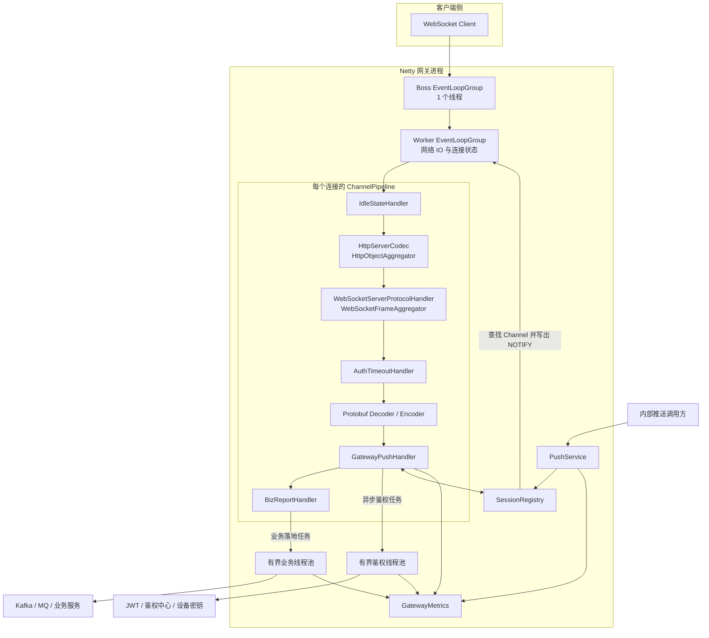
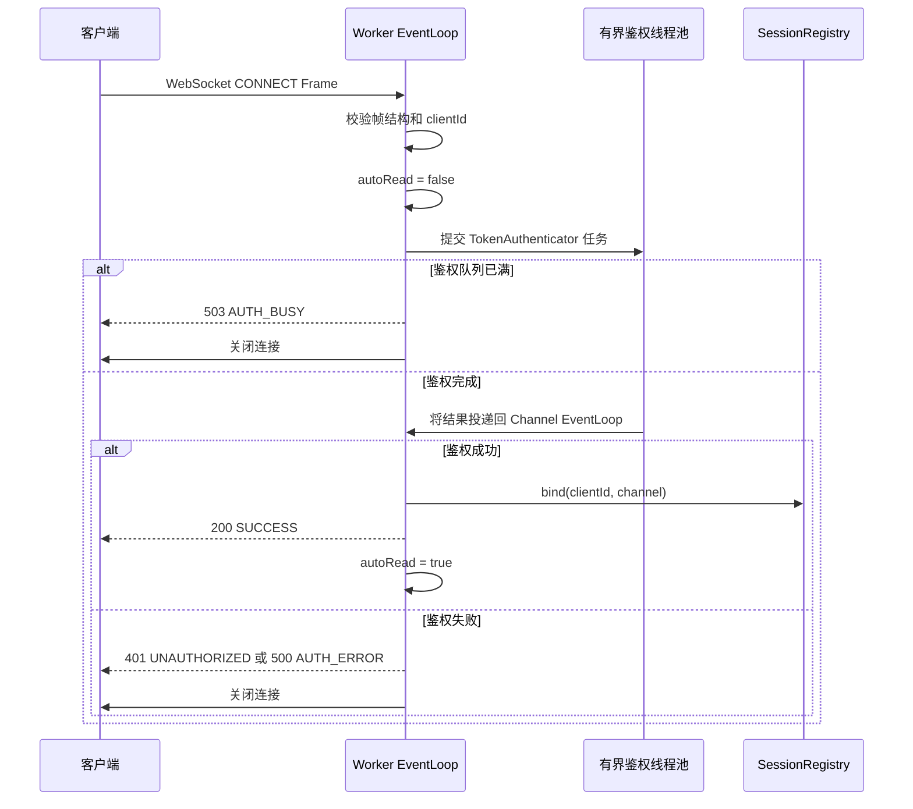
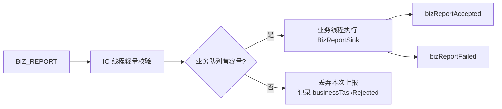
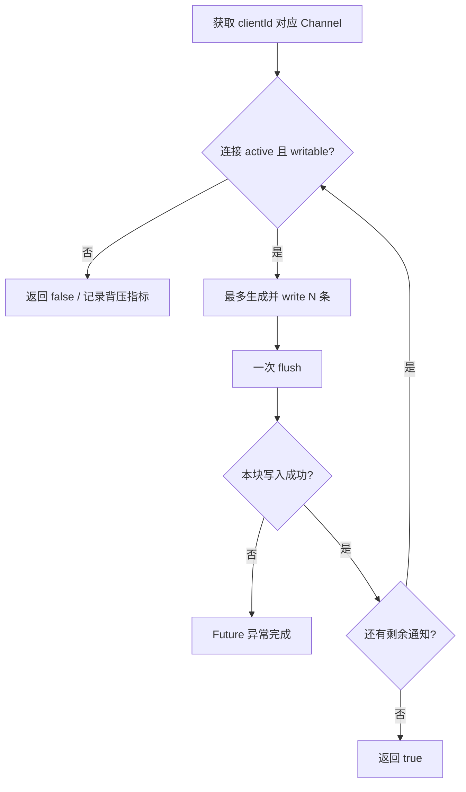
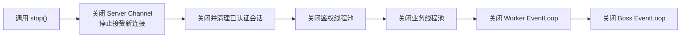

# Message Gateway 架构说明

## 设计目标

该项目是 Netty + WebSocket + Protobuf 推送网关的设计验证实现，重点验证以下能力：

- 长连接接入、鉴权、心跳、空闲连接清理与单机路由。
- IO、鉴权和业务处理三类工作负载隔离。
- 有界队列、写缓冲水位和分块推送组成的多级背压。
- WebSocket 分片聚合与 Protobuf 零中间数组编解码。
- 可替换的鉴权、业务落地和指标扩展接口。

## 组件架构

## 线程模型

| 执行域 | 主要职责 | 禁止事项 |
| --- | --- | --- |
| Boss EventLoop | 接受 TCP 连接 | 执行业务逻辑 |
| Worker EventLoop | HTTP/WebSocket/Protobuf 处理、心跳、会话状态变更、网络写入 | 阻塞 RPC、磁盘 IO、复杂计算 |
| 鉴权线程池 | Token 校验、签名计算、鉴权中心调用 | 修改 ChannelPipeline 或会话状态 |
| 业务线程池 | `BizReportSink` 落地 | 无限排队、直接操作连接状态 |

鉴权结果会切回原 Channel 的 EventLoop 后再绑定会话。鉴权期间关闭 `autoRead`，防止后续业务帧越过认证边界。

## CONNECT 鉴权时序

## 业务上报与过载保护

`GatewayPushHandler` 只负责确认客户端已认证，并将 `BIZ_REPORT` 交给 `BizReportHandler`。后者在 IO 线程做轻量校验，然后仅把 `BizReportSink.accept()` 投递到有界业务池。

handler 本身仍保留在 IO pipeline 中，因此业务队列饱和不会阻塞或拒绝 `channelInactive` 等连接生命周期事件。

## 主动推送与背压

单条推送在写入前检查 `Channel.isActive()` 和 `Channel.isWritable()`。批量推送按配置的块大小执行：

该策略不会一次性构造整批 Protobuf Frame，也不会一次性把所有消息压入 Netty outbound buffer。返回 `false` 时，已经成功写出的前置分块不会回滚，调用方需要按业务语义决定是否重试。

## 停机顺序

先关闭监听端口可以消除清理会话期间仍有新连接接入的竞态；Worker EventLoop 最后关闭，确保异步鉴权结果仍有机会完成必要的 EventLoop 回调。

## 扩展边界

- `TokenAuthenticator`：替换为 JWT、本地密钥或远程鉴权实现。
- `BizReportSink`：替换为 Kafka、消息队列或业务服务适配器。
- `GatewayMetrics`：替换为 Micrometer、Prometheus 或 OpenTelemetry 实现。
- `SessionRegistry`：当前为单机内存路由；集群场景需要增加用户到网关节点的外部路由层。

## 当前边界

- 项目定位为单节点设计验证，不包含跨节点路由、服务发现和连接迁移。
- 默认鉴权器仅验证 token 非空，不能直接作为生产安全方案。
- 业务上报队列饱和时采用丢弃策略，生产环境应结合业务重要性决定重试、降级或持久化缓冲。
